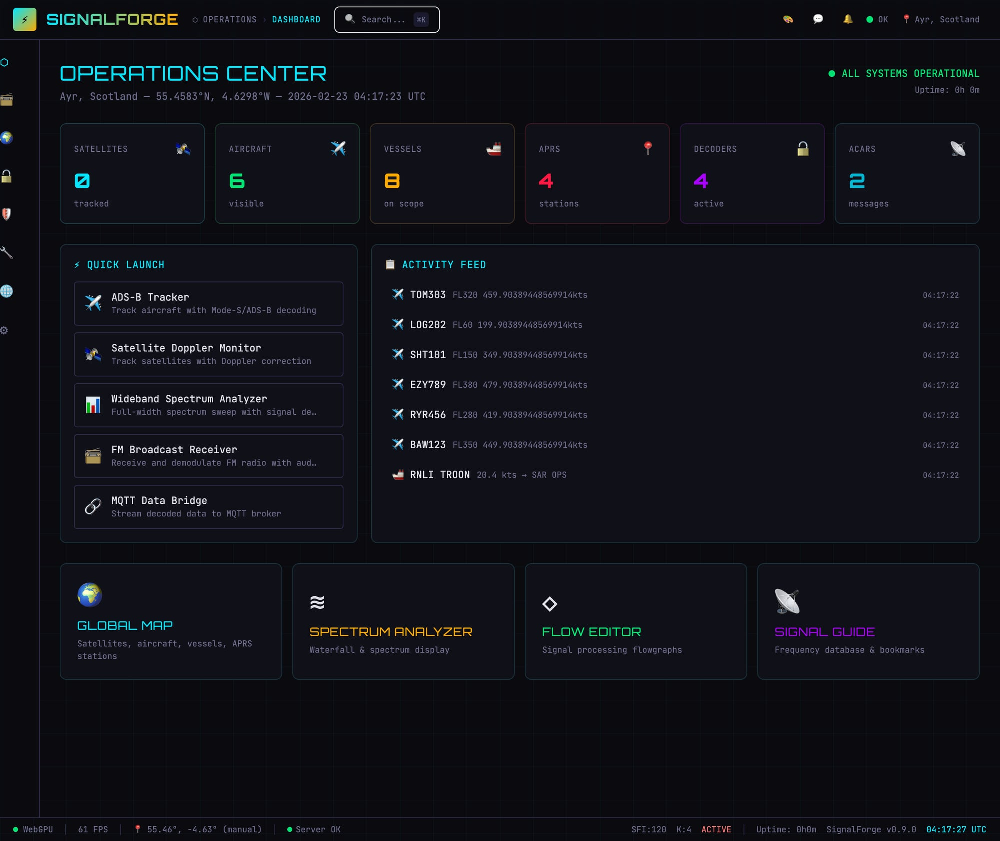
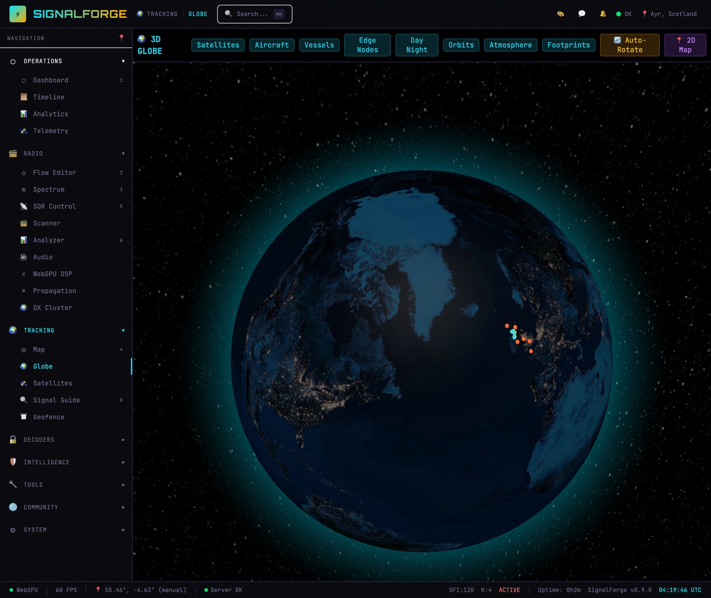
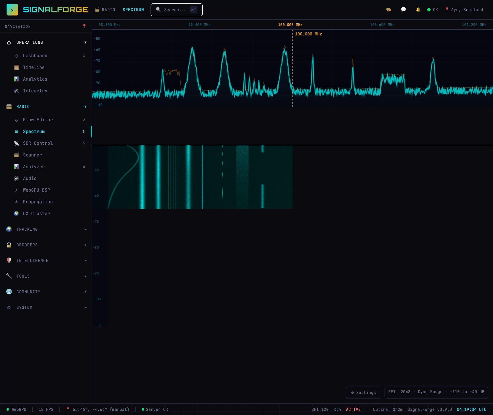
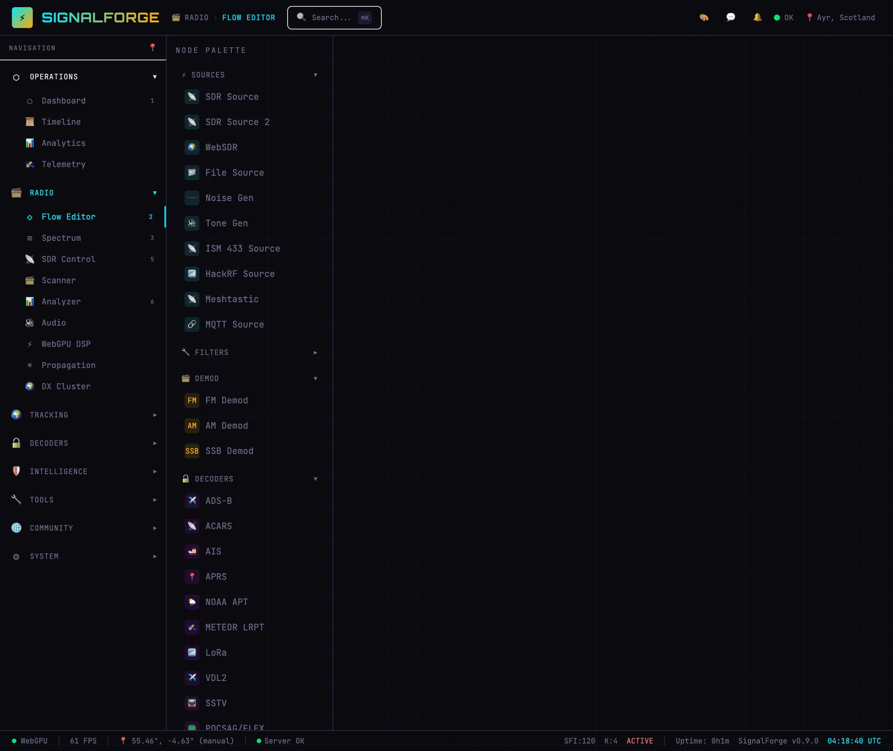
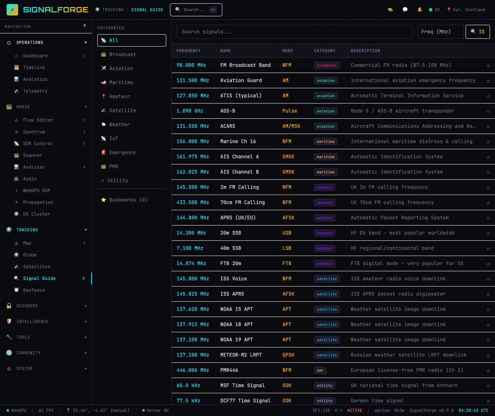
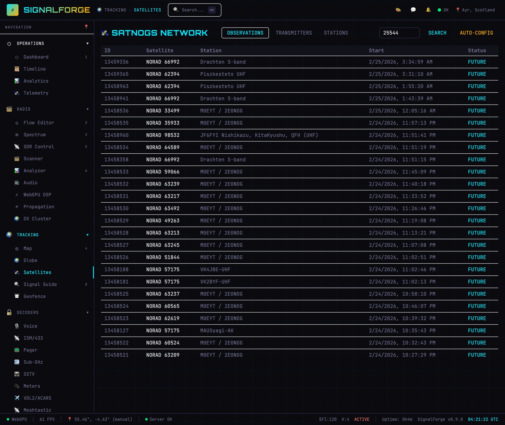
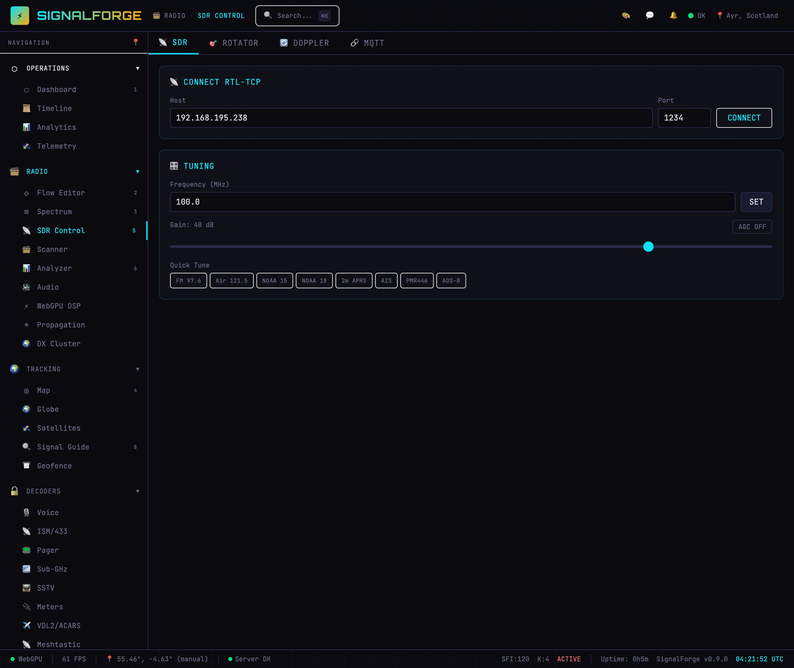

# ⚡ SignalForge

**Universal Radio Platform** — Browser-based, GPU-accelerated, flow-based signal processing for every band, every mode, every protocol.

<p align="center">
  
</p>

[](https://www.typescriptlang.org/)
[](https://react.dev/)
[](https://www.w3.org/TR/webgpu/)
[](LICENSE)

> **⚠️ Early Development** — SignalForge is under active development. See the [Reality Check](#-reality-check) section for an honest assessment of what works today versus what's planned.

---

## What is SignalForge?

SignalForge is a **visual, node-based radio signal processing platform** that runs in your browser. Think of it as a digital workbench where you wire together SDR sources, filters, demodulators, decoders, and displays — all rendered with GPU acceleration at 60fps+.

### 🎯 Target Domains

| Domain | Protocols / Signals |
|--------|-------------------|
| 🛰️ Satellite | TLE tracking, pass prediction, Doppler correction, SatNOGS |
| ✈️ Aviation | ADS-B, ACARS, VDL2 |
| 🚢 Maritime | AIS vessel tracking |
| 📻 Amateur Radio | APRS, digital voice (DMR/D-STAR/C4FM), DX cluster, logbook |
| 📡 RF Analysis | Spectrum analysis, waterfall, signal identification, TSCM |
| 🌡️ IoT/ISM | rtl_433 sensors, utility meters, sub-GHz |
| 📟 Paging | POCSAG, FLEX |
| 🌐 Mesh | Meshtastic LoRa |
| 🎵 Broadcast | FM/AM demodulation, SSTV, weather satellites |

## Screenshots

<p align="center">
  
  <br/><em>Operations Center — live activity feed, quick launch, system metrics</em>
</p>

<p align="center">
  
  <br/><em>3D Globe — night Earth, aircraft & vessel tracks, satellite orbits, starfield</em>
</p>

<p align="center">
  
  <br/><em>Spectrum Analyzer — real-time waterfall display with FM broadcast signals</em>
</p>

<p align="center">
  
  <br/><em>Flow Editor — 25+ node types, drag-and-drop signal processing pipelines</em>
</p>

<p align="center">
  
  <br/><em>Signal Guide — frequency database with categories, modes, and descriptions</em>
</p>

<p align="center">
  
  <br/><em>SatNOGS Network — real observation data, ground station search</em>
</p>

<p align="center">
  
  <br/><em>SDR Control — RTL-TCP connection, tuning, gain, quick-tune presets</em>
</p>

---

## ✨ Key Features

- **Flow Editor** — Visual node-based signal processing. Wire sources → filters → demodulators → outputs
- **25+ Node Types** — SDR sources, filters, demodulators, decoders, displays, sinks
- **Satellite Tracking** — 14,400+ satellites from CelesTrak with SGP4, pass prediction, Doppler
- **3D Globe** — Globe.gl with night Earth, satellite orbits, aircraft trails, vessel markers
- **Spectrum Analyzer** — Real-time waterfall and spectrum displays
- **Multi-SDR** — RTL-SDR (rtl_tcp), SoapySDR Remote, Aaronia Spectran V6
- **Protocol Decoders** — ADS-B, ACARS, AIS, APRS, POCSAG, VDL2, rtl_433
- **MCP Server** — 41 tools for AI agent integration
- **4 Themes** — Midnight, Amber Terminal, Arctic, High Contrast
- **Signal Database** — 28+ catalogued signals with frequencies and descriptions
- **Logbook** — ADIF-compatible amateur radio logging
- **Command Palette** — Ctrl+K quick navigation

---

## 🔍 Reality Check

**We believe in radical transparency.** Here's what actually works today versus what's demo/planned.

### ✅ Real — Works with actual data/hardware

| Feature | Notes |
|---------|-------|
| Satellite tracking | CelesTrak TLE + SGP4 — real orbital positions |
| APRS | **Live APRS-IS connection**, 2000 station cap, sortable/filterable table view |
| ADS-B | **OpenSky Network live feed** (fallback from local dump1090) |
| AIS | **Finnish Digitraffic live feed** (fallback from local decoder) |
| Rules/Triggers engine | **Full implementation** — 18 conditions, 10 actions, SQLite persistence, event-driven |
| Data Flow Editor | **Separate visual editor** for event processing pipelines (distinct from RF flow editor) |
| Map | Cursor-anchored zoom (0.3–64×), live entity display |
| RTL-TCP SDR bridge | Full protocol client, real IQ streaming |
| SoapySDR client | SoapyRemote protocol, connects to real servers |
| Rotator control | Hamlib rotctld TCP protocol |
| MQTT integration | Full MQTT 3.1.1 client |
| GPS/Location | gpsd client, browser geolocation, Nominatim geocoding |
| SatNOGS API | Real API integration |
| Browser DSP | FIR filters, FM/AM/SSB demod in JavaScript (Web Audio) |
| RF Flow editor | Canvas-based node graph — drag, drop, wire, save, load |
| Waterfall/Spectrum | Canvas rendering — works with real or demo data |
| 3D Globe | Globe.gl + Three.js, interactive, real satellite positions |
| WebSDR | KiwiSDR + WebSDR.org proxy — real radio signals |
| DX Cluster | Real telnet-style feed integration |
| UI/Navigation | Sidebar, command palette, themes, responsive |
| MCP server | 41 tools via @modelcontextprotocol/sdk |
| Signal database | 28+ built-in signals, searchable |
| SQLite persistence | Logbook, recordings, settings, geofences, bookmarks |

### 🟡 Demo Mode — Real code exists, needs hardware to fully light up

| Feature | What's needed |
|---------|--------------|
| IQ streaming | Plug in RTL-SDR → rtl_tcp → real waterfall |
| ACARS messages | Need acarsdec running |
| Observation scheduler | Needs SDR + rotator connected |

### 🟠 Stub — Structure exists, core logic is simulated

rtl_433 IoT, POCSAG/FLEX pager, sub-GHz/HackRF, SSTV, utility meters, WiFi/Bluetooth scanning, TSCM counter-surveillance, Meshtastic, VDL2, digital voice, Aaronia Spectran, number stations, audio streaming

### 🔴 Planned — UI/concept only

WebGPU compute shaders (DSP runs in JS currently), AI signal narrator, community hub, training academy, AI signal classifier, multi-window, time machine, integration hub, equipment manager, cinematic mode, waterfall recording, external plugin loader, edge node package, offline/field mode

📄 **Full details:** [docs/REALITY-CHECK.md](docs/REALITY-CHECK.md)

---

## 🗺️ Roadmap

### Completed

| Version | Phase | Highlights |
|---------|-------|-----------|
| v0.1.0 | Scaffold | Flow editor, waterfall demo, satellite map, dark UI |
| v0.2.0 | Foundations | 14,400 real satellites, ADS-B/ACARS/AIS/APRS decoders, enhanced waterfall |
| v0.3.0 | Observer | Location system (5 sources), signal database, recording framework, WebSDR, multi-SDR |
| v0.4.0 | Hardware | RTL-TCP bridge, SoapySDR, browser DSP, spectrum analyzer, Doppler, rotator, scheduler, MQTT, Docker |
| v0.5.0 | Platform | Multi-user, plugin architecture, edge nodes, frequency scanner, AI classifier, themes |
| v0.6.0 | Integration | SatNOGS, waterfall recording, geo-fencing, digital voice, propagation, logbook, DX cluster |
| v0.7.0 | SIGINT | rtl_433, POCSAG/FLEX, sub-GHz, SSTV, WiFi/BT scanning, TSCM, Meshtastic, VDL2, 41 MCP tools |
| v0.8.0 | Next-Gen | 3D globe, WebGPU DSP framework, AI narrator, community hub, training, multi-window |
| v0.9.0 | UI/UX | Design system, sidebar navigation, command palette, responsive, 4 theme polish, accessibility |
| v0.10.0 | Globe + Aaronia | Globe.gl 3D Earth, Aaronia Spectran V6 integration, TSCM profiles |

### Next Up

| Phase | Target | Description |
|-------|--------|-------------|
| **A: Real Core Loop** | Next | Connect RTL-SDR → real IQ → real waterfall → real FM demod → audio. SQLite persistence. |
| **B: Real Decoders** | Near-term | dump1090 ADS-B, rtl_433 IoT, direwolf APRS, acarsdec — via subprocess + JSON parse |
| **C: Edge Nodes** | Near-term | Real edge-node on Raspberry Pi + Hailo-8 AI. RTL-SDR + GPS → stream to server |
| **D: Hard Integrations** | Medium-term | DX cluster telnet, Meshtastic serial, SSTV decode, digital voice (DSD+), WebGPU FFT shaders |
| **E: Platform** | Long-term | Community backend, training content, real plugin loader, AI narrator, multi-window, persistence |

---

## Architecture

```
┌─────────────────────────────────────────────────────────┐
│                    Browser (Client)                       │
│  ┌──────────┐ ┌──────────┐ ┌─────────┐ ┌─────────────┐ │
│  │Flow Editor│ │Waterfall │ │3D Globe │ │ Dashboard   │ │
│  │(Canvas)  │ │(Canvas)  │ │(Globe.gl)│ │(React)      │ │
│  └────┬─────┘ └────┬─────┘ └────┬────┘ └──────┬──────┘ │
│       └─────────────┴────────────┴─────────────┘        │
│                        │ WebSocket                        │
└────────────────────────┼─────────────────────────────────┘
                         │
┌────────────────────────┼─────────────────────────────────┐
│                   Server (Node.js)                        │
│  ┌──────────┐ ┌──────────┐ ┌──────────┐ ┌────────────┐ │
│  │SDR Bridge│ │Satellite │ │Decoders  │ │ MCP Server │ │
│  │(rtl_tcp, │ │(SGP4,    │ │(ADS-B,   │ │(41 tools)  │ │
│  │ SoapySDR)│ │ SatNOGS) │ │ ACARS..) │ │            │ │
│  └──────────┘ └──────────┘ └──────────┘ └────────────┘ │
└──────────────────────────────────────────────────────────┘
                         │
┌────────────────────────┼─────────────────────────────────┐
│                   Edge Nodes (Pi)                         │
│  RTL-SDR → IQ Stream    GPS → Location    Hailo-8 → AI  │
└──────────────────────────────────────────────────────────┘
```

**Stack:** TypeScript throughout · React 19 · Vite · Express · WebSocket · Turborepo monorepo

---

## Quick Start

```bash
# Clone
git clone https://github.com/WispAyr/signalforge.git
cd signalforge

# Install dependencies
npm install

# Start development (frontend + backend)
npm run dev

# Open browser
open http://localhost:5180
```

### Requirements
- Node.js 20+
- Modern browser with WebGPU support (Chrome 113+, Edge 113+, Firefox Nightly)
- SDR hardware (RTL-SDR, Airspy, HackRF, etc.) — optional, demo mode available

---

## Project Structure

```
signalforge/
├── packages/
│   ├── client/          # React 19 + Vite frontend
│   ├── server/          # Express + WebSocket backend
│   ├── shared/          # Shared TypeScript types
│   ├── edge-node/       # Raspberry Pi edge package
│   └── mcp-server/      # MCP server (41 tools)
├── docs/                # Documentation, screenshots, logo
├── turbo.json           # Turborepo config
└── package.json         # Monorepo root
```

---

## The Flow Editor

The heart of SignalForge. Every radio operation is a visual pipeline:

```
┌──────────┐    ┌────────┐    ┌──────────┐    ┌─────────┐    ┌──────────┐
│ RTL-SDR  ├───→│ Filter ├───→│ FM Demod ├───→│ Audio   ├───→│ Speaker  │
│ Source   │    │ BPF    │    │          │    │ Resamp  │    │ Output   │
└──────────┘    └────────┘    └──────────┘    └─────────┘    └──────────┘
```

25+ node types. Drag from palette, wire together, tweak parameters in real-time.

---

## MCP Server

SignalForge exposes its full API as an MCP (Model Context Protocol) server with **41 tools**, enabling AI agents to control the radio platform programmatically.

```bash
# Start MCP server
cd packages/mcp-server && npm start
```

Categories: SDR control, satellite tracking, decoder management, scanning, flowgraph, recordings, logbook, alerts, propagation, edge nodes, IoT, TSCM, system health.

---

## 🙏 Acknowledgements

SignalForge stands on the shoulders of these excellent projects:

### [Ground Station](https://github.com/sgoudelis/ground-station) by sgoudelis
A remarkably complete satellite monitoring suite — SDR abstraction, multi-VFO DSP, automated observation scheduling, weather satellite decoding, telemetry parsing. Directly inspired SignalForge's satellite tracking, SDR integration, and observation scheduling. If you need a production-ready Python-based ground station today, go use it.

### [CyberEther](https://github.com/luigifcruz/CyberEther) by Luigi Cruz
Browser-based GPU-accelerated flowgraph engine. The foundational inspiration for SignalForge's visual pipeline architecture and the vision for WebGPU-accelerated signal processing. The idea that DSP pipelines should be visual and interactive came from studying CyberEther.

### [INTERCEPT](https://github.com/smittix/intercept) by smittix
A Python-based SIGINT platform that inspired Phase 7's feature set — rtl_433 IoT, POCSAG/FLEX, sub-GHz analysis, SSTV, WiFi/Bluetooth scanning, TSCM counter-surveillance, Meshtastic, number stations, and field mode. INTERCEPT demonstrated the breadth a modern SIGINT platform should cover.

### [Aaronia AG](https://www.aaronia.com)
Professional spectrum analyzers and EMC test equipment. SignalForge integrates with the RTSA-Suite PRO HTTP API for remote spectrum analysis and TSCM sweeps.

### Data Sources & Libraries
- **[CelesTrak](https://celestrak.org)** — TLE orbital data by Dr. T.S. Kelso
- **[OpenStreetMap](https://www.openstreetmap.org) / [Nominatim](https://nominatim.openstreetmap.org)** — Open geocoding
- **[WebSDR](http://websdr.org)** — Public SDR receivers by Pieter-Tjerk de Boer
- **[satellite.js](https://github.com/shashwatak/satellite-js)** — SGP4/SDP4 propagation
- **[Globe.gl](https://globe.gl)** — 3D globe visualization
- **[React](https://react.dev)** · **[Vite](https://vitejs.dev)** · **[Express](https://expressjs.com)** · **[Turborepo](https://turbo.build)**

---

## License

MIT © [WispAyr](https://github.com/WispAyr)
