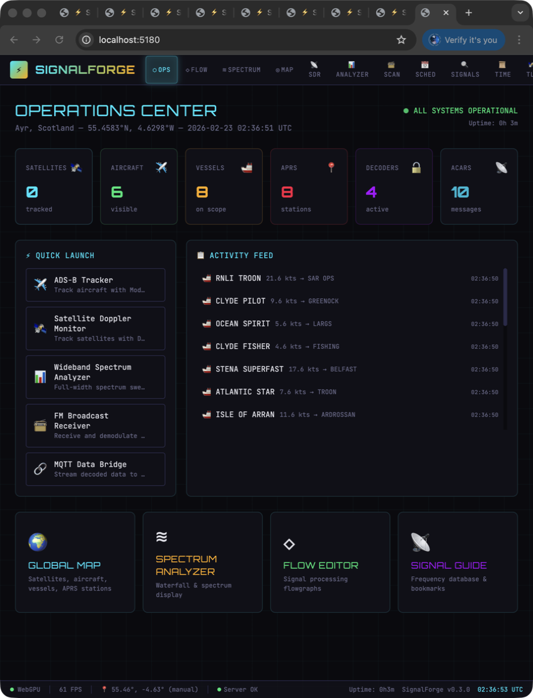
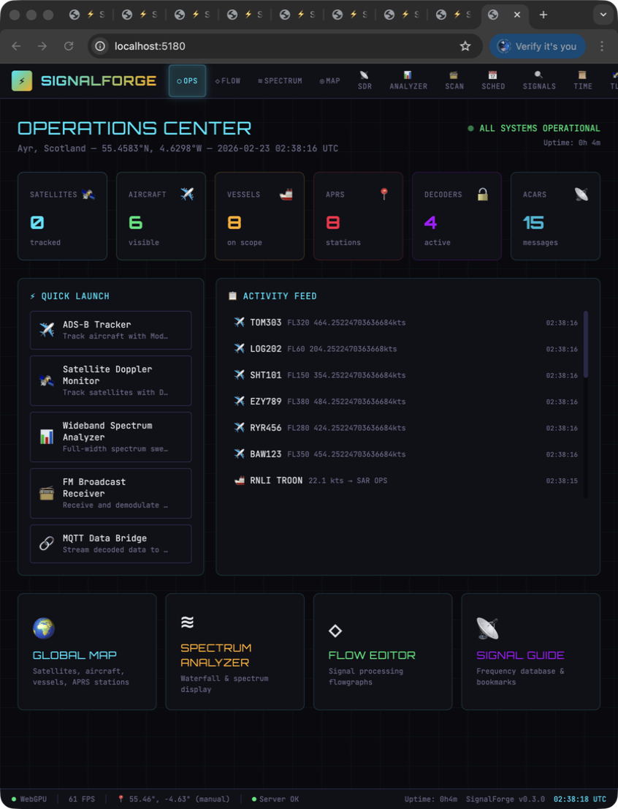
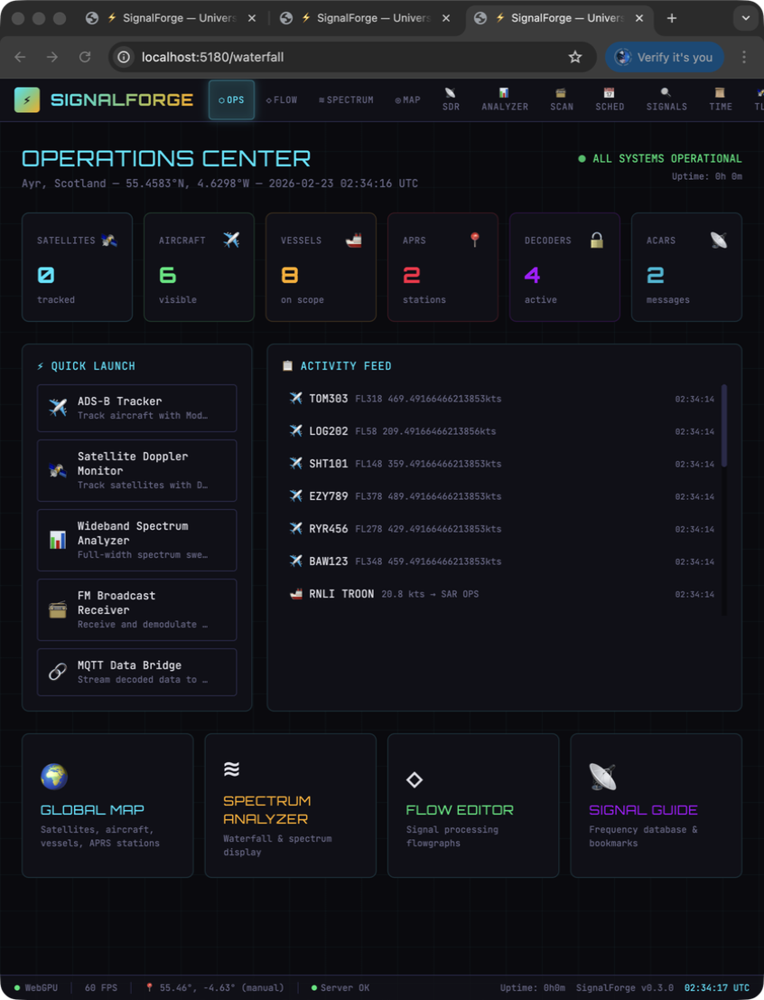
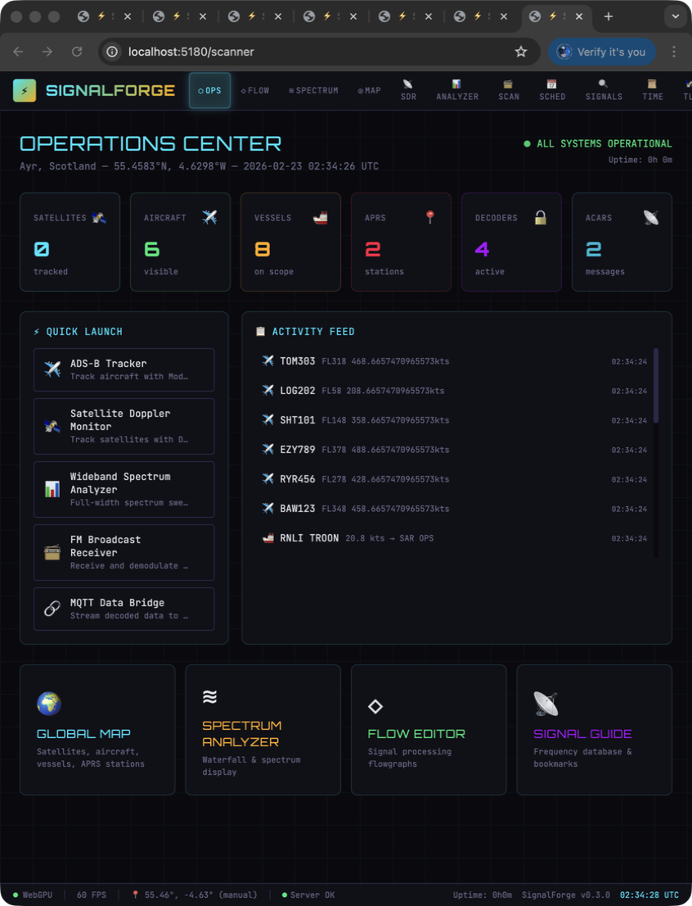

# ⚡ SignalForge

**Universal Radio Platform** — Browser-based, GPU-accelerated, flow-based signal processing for every band, every mode, every protocol.

<p align="center">
  
</p>

[](https://www.typescriptlang.org/)
[](https://react.dev/)
[](https://www.w3.org/TR/webgpu/)
[](LICENSE)

---

## What is SignalForge?

SignalForge is a **visual, node-based radio signal processing platform** that runs in your browser. Think of it as a digital workbench where you wire together SDR sources, filters, demodulators, decoders, and displays — all rendered with GPU acceleration at 60fps+.

### 🎯 Supported Domains

| Domain | Capabilities |
|--------|-------------|
| 🛰️ **Satellites** | TLE tracking, pass prediction, Doppler correction, weather sat image decoding (NOAA, METEOR) |
| 📻 **Amateur Radio** | HF/VHF/UHF, RAYNET emergency comms, repeater monitoring, APRS |
| ✈️ **Aviation** | ADS-B aircraft tracking, ACARS message decoding |
| 🚢 **Maritime** | AIS vessel tracking and identification |
| 📡 **IoT** | LoRa/Meshtastic packet decoding |
| ⚡ **Spectrum** | Wideband analysis, signal identification, waterfall display |
| 🌦️ **Weather** | APT/LRPT satellite image decoding, NOAA/METEOR |

## Screenshots

<p align="center">
  
  <br/><em>Operations Dashboard — system overview with live stats</em>
</p>

<p align="center">
  
  <br/><em>Visual Flow Editor — drag-and-drop signal processing chains</em>
</p>

<p align="center">
  
  <br/><em>Waterfall Display — real-time spectrum analysis</em>
</p>

<p align="center">
  
  <br/><em>Map View — satellites, aircraft, vessels, APRS stations</em>
</p>

<p align="center">
  
  <br/><em>Satellite Tracking — pass predictions with Doppler correction</em>
</p>

<p align="center">
  
  <br/><em>Frequency Scanner — sweep, detect, identify</em>
</p>

---

### ✨ Key Features

- **Visual Flow Editor** — Drag-and-drop node graph. Wire SDR sources → filters → demodulators → decoders → displays
- **GPU Waterfall** — WebGPU compute shaders for 60fps+ spectrum/waterfall rendering
- **Multi-SDR** — Connect multiple SDR devices simultaneously via WebUSB or WebSocket bridge
- **Live Map** — Real-time satellite footprints, aircraft positions, vessel tracks on an interactive map
- **Modular Decoders** — Each protocol is a flowgraph node: FM, AM, SSB, ADS-B, APRS, AIS, SSTV, LoRa...
- **Dark Sci-Fi UI** — LCARS-meets-mission-control aesthetic. Cyan and amber on dark. Beautiful.
- **TypeScript Throughout** — Frontend AND backend, unified stack

---

## Architecture

```
┌─────────────────────────────────────────────────────────────┐
│                    SignalForge Browser UI                     │
│                                                               │
│  ┌─────────┐  ┌──────────────┐  ┌─────────┐  ┌───────────┐ │
│  │ Flow    │  │ GPU Waterfall │  │ Map     │  │ Decoder   │ │
│  │ Editor  │  │ (WebGPU)     │  │ View    │  │ Panels    │ │
│  └────┬────┘  └──────┬───────┘  └────┬────┘  └─────┬─────┘ │
│       │              │               │              │        │
│  ┌────┴──────────────┴───────────────┴──────────────┴────┐  │
│  │              Flow Engine (Client-side DSP)             │  │
│  │  SDR Source → Filter → Demod → Decoder → Display      │  │
│  └────────────────────────┬──────────────────────────────┘  │
│                           │ WebSocket / WebUSB               │
└───────────────────────────┼──────────────────────────────────┘
                            │
┌───────────────────────────┼──────────────────────────────────┐
│                    SignalForge Server                         │
│                                                               │
│  ┌──────────┐  ┌──────────┐  ┌────────────┐  ┌───────────┐ │
│  │ SDR      │  │ Satellite │  │ IQ         │  │ Session   │ │
│  │ Bridge   │  │ Tracker   │  │ Streaming  │  │ Manager   │ │
│  └──────────┘  └──────────┘  └────────────┘  └───────────┘ │
│       │                                                       │
│  ┌────┴─────────────────────────────────────────────────┐    │
│  │           Hardware Abstraction Layer                   │    │
│  │   RTL-SDR │ Airspy │ HackRF │ USRP │ LimeSDR        │    │
│  └──────────────────────────────────────────────────────┘    │
└──────────────────────────────────────────────────────────────┘
```

See [ARCHITECTURE.md](ARCHITECTURE.md) for the full design.

---

## Quick Start

```bash
# Clone
git clone https://github.com/WispAyr/signalforge.git
cd signalforge

# Install dependencies
npm install

# Start development (frontend + backend)
npm run dev

# Open browser
open http://localhost:5180
```

### Requirements
- Node.js 20+
- Modern browser with WebGPU support (Chrome 113+, Edge 113+, Firefox Nightly)
- SDR hardware (RTL-SDR, Airspy, HackRF, etc.) — optional, demo mode available

---

## Project Structure

```
signalforge/
├── packages/
│   ├── client/          # React + WebGPU frontend
│   │   ├── src/
│   │   │   ├── components/    # UI components
│   │   │   ├── engine/        # Flow engine & node types
│   │   │   ├── gpu/           # WebGPU shaders & renderers
│   │   │   ├── nodes/         # Flowgraph node implementations
│   │   │   └── views/         # Main application views
│   │   └── index.html
│   ├── server/          # Node.js backend
│   │   └── src/
│   │       ├── sdr/           # SDR hardware bridge
│   │       ├── satellite/     # Orbital mechanics
│   │       └── streaming/     # WebSocket IQ streaming
│   └── shared/          # Shared TypeScript types
│       └── src/
│           ├── flow.ts        # Flow graph types
│           ├── sdr.ts         # SDR types
│           └── satellite.ts   # Satellite types
├── docs/                # Documentation & assets
├── package.json         # Monorepo root
└── turbo.json          # Turborepo config
```

---

## The Flow Editor

The heart of SignalForge. Every radio operation is a visual pipeline:

```
┌──────────┐    ┌────────┐    ┌──────────┐    ┌─────────┐    ┌──────────┐
│ RTL-SDR  ├───→│ Filter ├───→│ FM Demod ├───→│ Audio   ├───→│ Speaker  │
│ Source   │    │ BPF    │    │          │    │ Resamp  │    │ Output   │
└──────────┘    └────────┘    └──────────┘    └─────────┘    └──────────┘
                                   │
                              ┌────┴─────┐
                              │ Waterfall│
                              │ Display  │
                              └──────────┘
```

Nodes snap together. Data flows left-to-right. Every parameter is tweakable in real-time.

---

## Acknowledgements

SignalForge stands on the shoulders of two outstanding projects that directly inspired its architecture and vision:

### 🛰️ [Ground Station](https://github.com/sgoudelis/ground-station) by sgoudelis

An exceptionally comprehensive satellite monitoring suite featuring multi-SDR support via SoapySDR, real-time satellite tracking with SGP4/Skyfield, automated observation scheduling, a rich waterfall display with VFO markers, and a full DSP pipeline with 16+ demodulators and decoders. Ground Station's approach to TLE synchronisation, pass prediction, Doppler correction, telemetry parsing (AX.25/CCSDS/CSP), and its handler-based Socket.IO architecture were a direct inspiration for SignalForge's satellite tracking, SDR integration, and observation concepts. If you need a production-grade Python-based ground station today, [go use it](https://github.com/sgoudelis/ground-station) — it's remarkable.

### ⚡ [CyberEther](https://github.com/luigifcruz/CyberEther)

A pioneering browser-based, GPU-accelerated signal processing engine that proved the viability of WebGPU for real-time radio DSP in the browser. CyberEther's flow-based visual pipeline architecture — where signal processing blocks are wired together as a directed graph with GPU-accelerated rendering — is the foundational concept behind SignalForge's flow editor and our roadmap for client-side WebGPU DSP. The idea that a waterfall display could run at 60fps+ in a browser via compute shaders came directly from this project.

---

Both projects demonstrated that the future of software-defined radio is open, visual, and browser-native. SignalForge aims to build on their pioneering work by combining satellite tracking, multi-protocol decoding, and GPU-accelerated visualisation into a unified TypeScript platform.

---

---

## 🙏 Acknowledgements / Inspired By

SignalForge stands on the shoulders of these excellent projects:

### [Ground Station](https://github.com/sgoudelis/ground-station) by sgoudelis
A remarkably complete satellite monitoring suite — SDR abstraction, multi-VFO DSP, automated observation scheduling, weather satellite decoding, telemetry parsing. Directly inspired SignalForge's satellite tracking, SDR integration, and observation scheduling architecture. If you need a production-ready Python-based ground station, check it out.

### [CyberEther](https://github.com/aspect-build/cyberether)
Browser-based GPU-accelerated flowgraph engine. Inspired the flow-based visual pipeline architecture and the vision for WebGPU-accelerated signal processing in the browser. The idea that DSP pipelines should be visual and interactive came from studying CyberEther's approach.

### [CelesTrak](https://celestrak.org)
Dr. T.S. Kelso's satellite tracking data service — the essential source for TLE orbital data that makes satellite pass prediction possible.

### [OpenStreetMap](https://www.openstreetmap.org) / [Nominatim](https://nominatim.openstreetmap.org)
Open geocoding service used for the place-name search in the observer location system. No API key needed, free for everyone.

### [WebSDR](http://websdr.org)
Pieter-Tjerk de Boer's network of publicly accessible software-defined radio receivers. The WebSDR integration lets users explore radio worldwide without owning hardware.

### Key Libraries
- **[satellite.js](https://github.com/shashwatak/satellite-js)** — SGP4/SDP4 satellite propagation in JavaScript
- **[React](https://react.dev)** — UI framework
- **[Vite](https://vitejs.dev)** — Build tooling
- **[Express](https://expressjs.com)** — HTTP server
- **[Turborepo](https://turbo.build)** — Monorepo build system

---

## License

MIT © [WispAyr](https://github.com/WispAyr)
